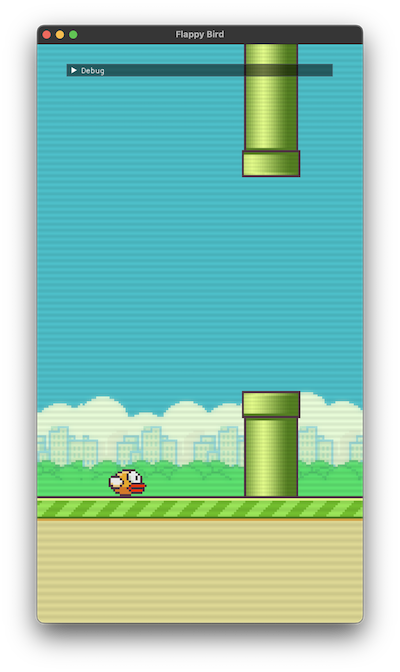

A small 2D C++ Game Framework, made for educational purposes.

Disclaimer: ~80% of this codebase was copied by hand from https://github.com/NoelFB/blah in order to learn CPP and OpenGL.
Blah is great place to start if you already know the basics and want to learn how to put together an OpenGL abstraction + sprite batcher + shader/material system, etc. (Thanks @NoelFB for making this public) 

The remaining ~20% are deviations I took to learn different libraries or just because I wanted to structure
the code differently.

*WIP*

It includes a demo project in the sandbox directory (a simple Flappy Bird clone):

